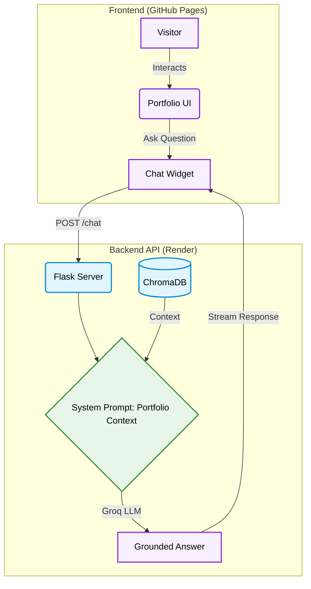

<div align="center">

# Shashank Singh - Personal Portfolio

**A clean, modern, and highly responsive platform to display my technical capabilities, ranging from systems programming to building full-stack AI/ML pipelines and agentic applications.**

[](https://developer.mozilla.org/en-US/docs/Web/HTML)
[](https://developer.mozilla.org/en-US/docs/Web/CSS)
[](https://developer.mozilla.org/en-US/docs/Web/JavaScript)
[](https://www.python.org/)
[](https://flask.palletsprojects.com/)
[](https://groq.com/)
[](https://www.trychroma.com/)

</div>

---

## Overview

Welcome to the source code of my personal portfolio website! This repository hosts the front-end code that powers [shashank17singh.github.io](https://shashank17singh.github.io/), where I showcase my professional experience, skills, and featured software engineering projects. It also includes a custom RAG-powered AI Chatbot backend (`/api`) that allows visitors to ask questions about my experience.

This project is intentionally built with core web technologies, avoiding heavy frameworks to ensure maximum performance and fast load times.

---

## Architecture



---

## Features

| | |
|---|---|
| **Responsive Design** | Fluid layout that scales elegantly across mobile, tablet, and desktop viewports |
| **Project Showcase** | A detailed grid highlighting my best projects with tech stack pills and live links |
| **Dynamic Interactions** | Scroll-reveal animations and interactive hover states for a polished UI |
| **Dark-Themed UI** | Modern dark-mode aesthetic utilizing CSS variables for consistent theming |
| **AI Assistant** | An integrated chatbot that answers questions based on my resume/experience |

---

## Tech Stack

| Component | Technology |
|---|---|
| **Frontend** | HTML5, CSS3, Vanilla JavaScript |
| **API Framework** | Flask |
| **LLM Inference** | Groq (`openai/gpt-oss-20b`) |
| **Embeddings** | HuggingFace (`all-MiniLM-L6-v2`) |
| **Vector Store** | ChromaDB |

---

## Project Structure

```text
shashank17singh.github.io/
├── api/
│   ├── app.py             # Flask application & /chat endpoint
│   ├── ingest.py          # Script to populate ChromaDB with portfolio knowledge
│   ├── requirements.txt   # Python dependencies
│   └── Dockerfile         # Docker configuration for API deployment
├── index.html             # Main portfolio webpage
├── profile.jpg            # Profile image
└── README.md              # Project documentation
```

---

## Setup and Installation

### Frontend

Simply open `index.html` in any modern web browser or serve it via a local static file server:

```bash
npx serve .
```

### Backend (Chatbot API)

1. Navigate to the API directory:
```bash
cd api
```

2. Install dependencies:
```bash
pip install -r requirements.txt
```

3. Set your Groq API key:
```bash
# Create a .env file and add your GROQ_API_KEY
echo "GROQ_API_KEY=your_api_key_here" > .env
```

4. Run the server:
```bash
python app.py
```

---

## Connect with Me

- **LinkedIn**: [Shashank Singh](https://www.linkedin.com/in/shashank-singh-152014282/)
- **GitHub**: [@Shashank17singh](https://github.com/Shashank17singh)
- **Email**: [shashanksingh1709@gmail.com](mailto:shashanksingh1709@gmail.com)
