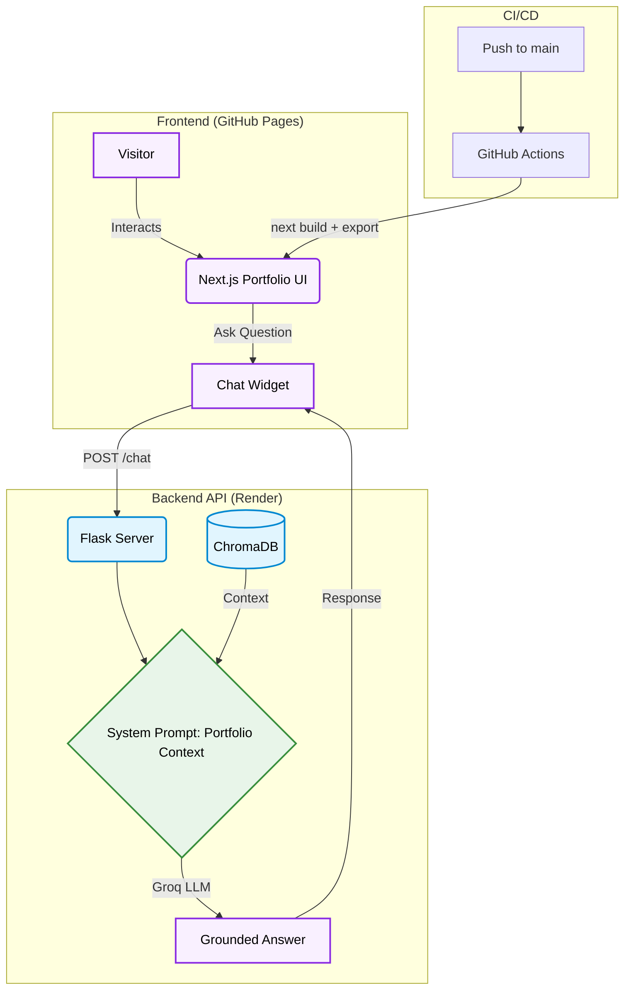

<div align="center">

<h1 align="center">Shashank Singh - Personal Portfolio</h1>

**A fast, responsive developer portfolio built with Next.js, featuring a RAG-powered AI chatbot that answers questions about my experience and projects.**

[](https://nextjs.org/)
[](https://react.dev/)
[](https://developer.mozilla.org/en-US/docs/Web/JavaScript)
[](https://www.python.org/)
[](https://flask.palletsprojects.com/)
[](https://groq.com/)
[](https://www.trychroma.com/)
[](https://github.com/features/actions)

**Live site:** [shashank17singh.github.io](https://shashank17singh.github.io/)

</div>

---

## Overview

This repository contains the source code for my personal portfolio, where I showcase my experience, skills, and featured projects across systems programming, ML/AI, and full-stack development.

The site is a **Next.js** app exported as static files and hosted on **GitHub Pages**. Deployment is automated with **GitHub Actions** on every push to `main`. A separate **Flask + ChromaDB + Groq** backend (hosted on Render) powers an AI chat assistant that gives grounded answers about my background.

---

## Architecture


```mermaid
graph TD
    subgraph "Frontend (GitHub Pages)"
    A[Visitor] -->|Interacts| B(Next.js Portfolio UI)
    B -->|Ask Question| C[Chat Widget]
    end

    subgraph "Backend API (Render)"
    C -->|POST /chat| D(Flask Server)
    D --> E{System Prompt: Portfolio Context}
    F[(ChromaDB)] -->|Context| E
    E -->|Groq LLM| G[Grounded Answer]
    G -->|Response| C
    end

    subgraph "CI/CD"
    H[Push to main] --> I[GitHub Actions]
    I -->|next build + export| B
    end

    classDef io fill:#f9f0ff,stroke:#8a2be2,stroke-width:2px,color:#000;
    classDef core fill:#e1f5fe,stroke:#0288d1,stroke-width:2px,color:#000;
    classDef logic fill:#e8f5e9,stroke:#388e3c,stroke-width:2px,color:#000;

    class A,B,C,G io;
    class D,F core;
    class E logic;
```

---

## Features

| Feature                  | Description                                                           |
| ------------------------ | --------------------------------------------------------------------- |
| **Responsive Design**    | Fluid layout that scales across mobile, tablet, and desktop           |
| **Project Showcase**     | Grid of featured projects with tech stack pills and live links        |
| **Dynamic Interactions** | Scroll-reveal animations and interactive hover states                 |
| **Dark-Themed UI**       | Dark-mode aesthetic with consistent theming                           |
| **AI Assistant**         | RAG chatbot that answers questions based on my resume and experience  |
| **Automated Deploys**    | Every push to `main` builds and publishes the site via GitHub Actions |

---

## Tech Stack

| Component           | Technology                       |
| ------------------- | -------------------------------- |
| **Frontend**        | Next.js, React (static export)   |
| **Hosting**         | GitHub Pages                     |
| **CI/CD**           | GitHub Actions                   |
| **API Framework**   | Flask                            |
| **LLM Inference**   | Groq (`openai/gpt-oss-20b`)      |
| **Embeddings**      | HuggingFace (`all-MiniLM-L6-v2`) |
| **Vector Store**    | ChromaDB                         |
| **Backend Hosting** | Render                           |

---

## Project Structure

```
shashank17singh.github.io/
├── .github/workflows/
│   └── deploy.yml         # Build & deploy to GitHub Pages
├── next_portfolio/        # Next.js frontend (source of the live site)
├── api/
│   ├── app.py             # Flask application & /chat endpoint
│   ├── ingest.py          # Populates ChromaDB with portfolio knowledge
│   ├── requirements.txt   # Python dependencies
│   └── Dockerfile         # Docker configuration for API deployment
├── sync_repos.py          # Utility script
├── render.yaml            # Render deployment config for the API
├── LICENSE
└── README.md
```

---

## Setup and Installation

### Frontend

```bash
cd next_portfolio
npm install
npm run dev
```

The app runs at `http://localhost:3000`.

To create the static production build locally:

```bash
npm run build   # outputs static files to next_portfolio/out
```

Set the chatbot backend URL via an environment variable, for example in `next_portfolio/.env.local`:

```bash
NEXT_PUBLIC_API_URL=http://localhost:5000
```

### Backend (Chatbot API)

1. Navigate to the API directory:

```bash
cd api
```

2. Install dependencies:

```bash
pip install -r requirements.txt
```

3. Set your Groq API key:

```bash
echo "GROQ_API_KEY=your_api_key_here" > .env
```

4. (Optional) Re-ingest portfolio knowledge into ChromaDB:

```bash
python ingest.py
```

5. Run the server:

```bash
python app.py
```

---

## Deployment

**Frontend:** Deployed automatically to GitHub Pages by `.github/workflows/deploy.yml` on every push to `main`. In the repository settings, **Pages -> Source** must be set to **GitHub Actions**. The Next.js config uses `output: 'export'` so the site builds to static files.

**Backend:** Deployed on Render using `render.yaml` / the `Dockerfile` in `api/`. Make sure CORS allows `https://shashank17singh.github.io`.

---

## Connect with Me

- **LinkedIn**: [Shashank Singh](https://www.linkedin.com/in/shashank-singh-152014282/)
- **GitHub**: [@Shashank17singh](https://github.com/Shashank17singh)
- **Email**: [shashanksingh1709@gmail.com](mailto:shashanksingh1709@gmail.com)

---

## License

This project is licensed under the [MIT License](LICENSE).
