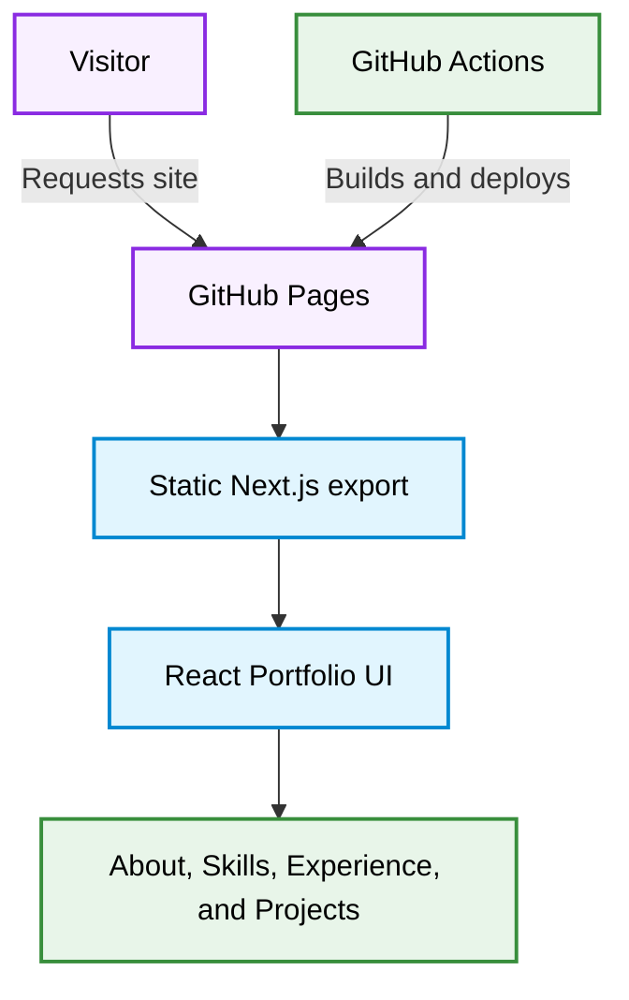

<div align="center">

# Shashank Singh - Personal Portfolio

**A clean, modern, and highly responsive portfolio showcasing my technical capabilities across AI engineering, full-stack development, and systems programming.**

[](https://nextjs.org/)
[](https://react.dev/)
[](https://www.typescriptlang.org/)
[](https://tailwindcss.com/)
[](https://www.framer.com/motion/)
[](https://pages.github.com/)

</div>

---

## Overview

Welcome to the source code of my personal portfolio website. This repository powers [shashank17singh.github.io](https://shashank17singh.github.io/), where I showcase my experience, skills, and featured software engineering projects.

The portfolio is built as a Next.js application and statically exported for deployment on GitHub Pages.

---

## Architecture


```mermaid
graph TD
    A[Visitor] -->|Requests site| B[GitHub Pages]
    B --> C[Static Next.js export]
    C --> D[React Portfolio UI]
    D --> E[About, Skills, Experience, and Projects]

    F[GitHub Actions] -->|Builds and deploys| B

    classDef io fill:#f9f0ff,stroke:#8a2be2,stroke-width:2px,color:#000;
    classDef core fill:#e1f5fe,stroke:#0288d1,stroke-width:2px,color:#000;
    classDef logic fill:#e8f5e9,stroke:#388e3c,stroke-width:2px,color:#000;

    class A,B io;
    class C,D core;
    class E,F logic;
```

---

## Features

|                          |                                                                                    |
| ------------------------ | ---------------------------------------------------------------------------------- |
| **Responsive Design**    | Fluid layout that scales across mobile, tablet, and desktop viewports              |
| **Project Showcase**     | A detailed project grid with technology tags and repository links                  |
| **Dynamic Interactions** | Scroll-reveal animations and polished hover states powered by Framer Motion        |
| **Dark-Themed UI**       | Modern dark-mode aesthetic using Tailwind CSS utilities and design tokens          |
| **Static Deployment**    | Optimized static export and automated deployment through GitHub Pages               |

---

## Tech Stack

| Component         | Technology                    |
| ----------------- | ----------------------------- |
| **Framework**     | Next.js 16, React 19          |
| **Language**      | TypeScript                    |
| **Styling**       | Tailwind CSS 4                |
| **Animations**    | Framer Motion                 |
| **Icons**         | Lucide React                  |
| **Deployment**    | GitHub Pages, GitHub Actions  |

---

## Project Structure

```text
shashank17singh.github.io/
├── .github/workflows/     # GitHub Pages deployment workflow
├── next_portfolio/
│   ├── src/app/           # Page, layout, and global styles
│   ├── src/components/    # Portfolio sections and reusable UI
│   ├── public/            # Static assets
│   ├── next.config.ts     # Static-export configuration
│   └── package.json       # Application scripts and dependencies
└── README.md              # Project documentation
```

---

## Setup and Installation

### Frontend

1. Navigate to the Next.js application:

```bash
cd next_portfolio
```

2. Install dependencies:

```bash
npm install
```

3. Start the development server:

```bash
npm run dev
```

Open [http://localhost:3000](http://localhost:3000) in your browser.

### Production Build

Create the static GitHub Pages artifact locally:

```bash
cd next_portfolio
npm run build
```

The generated site is written to `next_portfolio/out/`. Pushing to `main` runs the GitHub Actions workflow and deploys it to GitHub Pages.

---

## Connect with Me

- **LinkedIn**: [Shashank Singh](https://www.linkedin.com/in/shashank-singh-152014282/)
- **GitHub**: [@Shashank17singh](https://github.com/Shashank17singh)
- **Email**: [shashanksingh1709@gmail.com](mailto:shashanksingh1709@gmail.com)
